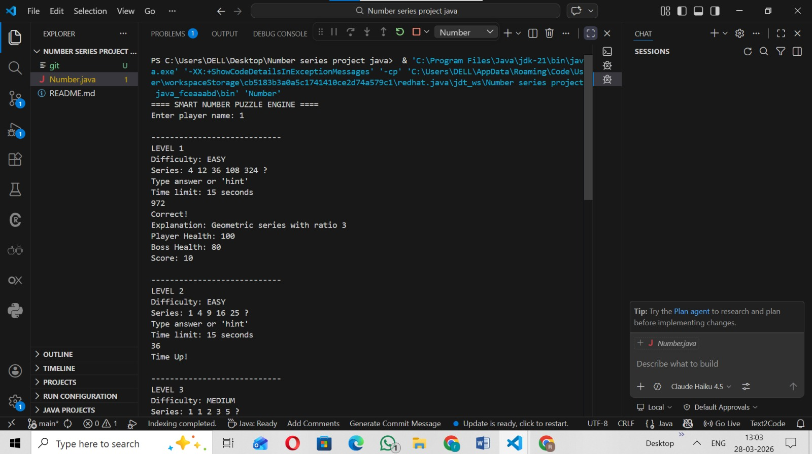
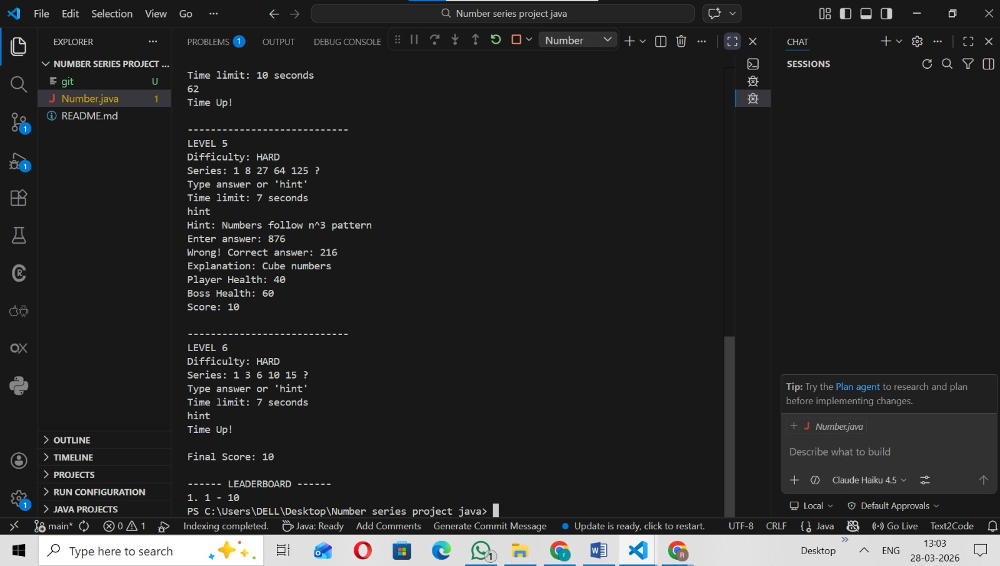
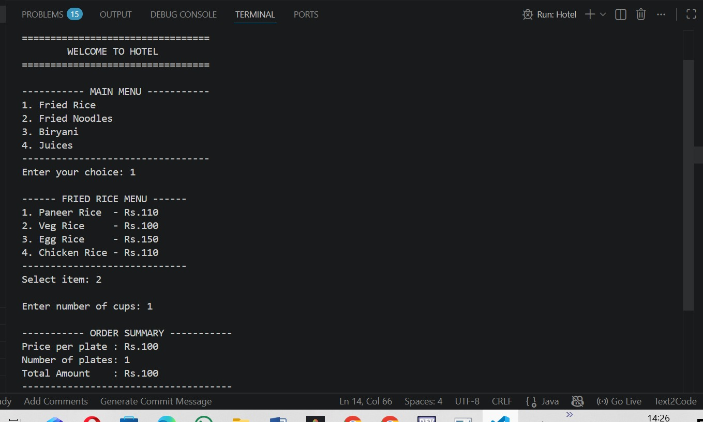

# NumberSeries
# 🎮 Smart Number Puzzle Engine

A Java-based interactive puzzle game that challenges users to solve number series problems with increasing difficulty.

---

## 🚀 Features

- 🎯 Multiple levels (Easy, Medium, Hard)
- ⏱️ Time-based challenges
- 💡 Hint system (with score penalty)
- ❤️ Health system (Player vs Boss)
- 🧠 Different puzzle types:
  - Arithmetic
  - Geometric
  - Fibonacci
  - Square series
  - Cube series
  - Pattern-based sequences
- 🏆 Leaderboard system

---

## 🛠️ Technologies Used

- Java
- OOP Concepts
- Collections Framework (ArrayList, HashSet)

---

## 📷 Screenshot





---

## ▶️ How to Run 

1. Compile the program:
```bash
javac Number.java

---
# 🟫🟫🟫 🍽️ HOTEL MANAGEMENT SYSTEM 🍽️ 🟫🟫🟫

## ███████████████████████████████████████████
## 🔥 JAVA CONSOLE APPLICATION 🔥
## ███████████████████████████████████████████

---

### 🧾 DESCRIPTION
A simple Java-based console application that simulates a hotel ordering system where users can select food items, place orders, and view the total bill.

---

## 🚀 FEATURES

- 📋 Menu-driven interface  
- 🍛 Multiple categories:
  - Fried Rice  
  - Fried Noodles  
  - Biryani  
  - Juices  
- 🧾 Order summary with total bill calculation  
- ✅ Order confirmation system  
- ❌ Order cancellation option  
- 🔄 User-friendly console interaction  

---

## 🛠️ TECHNOLOGIES USED

- Java  
- OOP Concepts  
- Scanner Class  

---

## 📷 SCREENSHOTS




---

## ▶️ HOW TO RUN

```bash
javac Hotel.java
java hotelmanagement.Hotel

